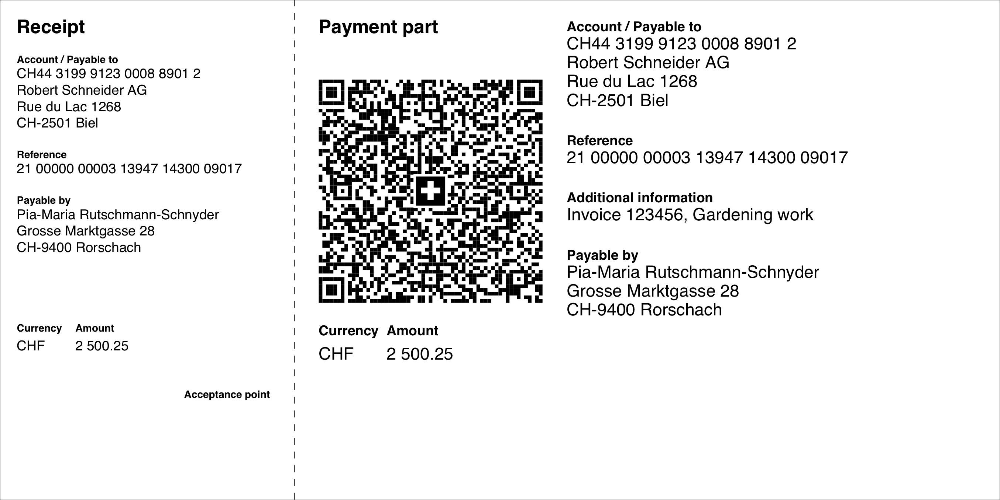

# Swiss QR Bill

[](https://github.com/sprain/php-swiss-qr-bill/actions)

A PHP library to create Swiss QR Bill payment parts (_QR-Rechnung_).




## Getting started

```
composer require sprain/swiss-qr-bill
```

Then have a look at [example/example.php](example/example.php).

## FAQs
* **Why is my IBAN not working?**<br>
A typical QR bill ([example](https://github.com/sprain/php-swiss-qr-bill/blob/master/example/example.php)) requires a special QR IBAN. You can get yours from your bank. A classic IBAN can be used for QR bills with a SCOR reference ([example](https://github.com/sprain/php-swiss-qr-bill/blob/master/example/example_scor.php)) or no reference number at all ([example](https://github.com/sprain/php-swiss-qr-bill/blob/master/example/example_minimal.php)).

* **How do I recognize a QR IBAN?**<br>
In a QR IBAN, the *institute id*, which is defined in the 5th to 9th character, is a number in the range of 30000 to 31999. (Example: CH44 **3199 9**123 0008 8901 2). For how to detect it in code, see https://github.com/sprain/php-swiss-qr-bill/issues/182#issuecomment-1229539977

* **How do I create QR bills for international IBANs?**<br>
You can't. The QR bill by specification only supports IBANs from Switzerland and Liechtenstein.

* **How do I support currencies other than CHF or EUR?**<br>
You can't. The QR bill by specification only supports CHF and EUR.

* **How do I change translations to use my own wording?**<br>
You can't. The translations are defined in the QR bill specification and are not meant to be changed by the user. See [this document](https://github.com/sprain/php-swiss-qr-bill/blob/master/docs/specs/style-guide-en.pdf), page 31.

* **How do I make my QR bills payable by Twint?**<br>
See https://github.com/sprain/php-swiss-qr-bill/issues/129 

* **What PDF libraries are supported by this library?**<br>
The following libraries are currently actively supported:
  * [fpdf/fpdf](https://packagist.org/packages/fpdf/fpdf)
  * [tecnickcom/tcpdf](https://packagist.org/packages/tecnickcom/tcpdf)
  * [setasign/fpdi](https://packagist.org/packages/setasign/fpdi) (accepted by `FpdfOutput` and `TcPdfOutput`)

  The output of `HtmlOutput` is known to be used to generate PDFs with [PrinceXML](https://www.princexml.com), [Docraptor](http://docraptor.com), and [dompdf/dompdf](https://packagist.org/packages/dompdf/dompdf) (with some adjustments as decribed [here](https://github.com/sprain/php-swiss-qr-bill/issues/178#issuecomment-1222752493))

* **Why are you using `final` on most classes? I want to extend them!**<br>
This library implements the official specification of the QR bill. This implementation is not supposed to be adjusted as it might result in broken QR bills. Therefore many classes are marked as final. If you find the need to extend one of those final classes, you might have found a bug in this library. In that case it will be very helpful if you provide a bug report or even a pull request here. Thank you!


## Getting help

Do you need more help using this library?

* [Search the existing and closed issues](https://github.com/sprain/php-swiss-qr-bill/issues?q=is%3Aissue) to see if you find your answer there.
* If you still need help, you may [create an issue](https://github.com/sprain/php-swiss-qr-bill/issues) yourself to ask your question.

Please note that the maintainer of this library will not provide any support by email.
The beauty of open source software lies in the fact that everybody can benefit from each other. Therefore questions will only be answered in public.

## Versioning

[Semantic versioning](https://semver.org/) is used for this library.

In addition, a minor version will always be published if any visible change in the output of the qr code or the payment part takes place, even if it could be considered to be just a bugfix.

### PHP version support

This library supports a PHP version as long as it accounts for at least 10% [of current installations](https://packagist.org/packages/sprain/swiss-qr-bill/php-stats).

### Depdendency support

Older versions of dependencies are supported as long as they do not hinder further development or accounts for at least
10% of current installations of the corresponding dependency.

## Support the project

* Do you like this project? [Consider a Github sponsorship.](https://github.com/sponsors/sprain)
* Would you like to contribute? [Have a look at the open issues.](https://github.com/sprain/php-swiss-qr-bill/issues) Be nice to each other.
* Spread the word!


## Official resources
The repository contains the official specifications the library is based on:

- [Swiss Implementation Guidelines QR-bill](docs/specs/ig-qr-bill-en-v2.2.pdf)
- [Technical information about the QR-IID and QR-IBAN](docs/specs/qr-iid_qr-iban-en.pdf)
- [Style Guide QR-bill](docs/specs/style-guide-en.pdf)
- [Validation Tool](https://validation.iso-payments.ch/gp/qrrechnung/validation/)

For more official information see
- [https://www.six-group.com/en/products-services/banking-services/payment-standardization/standards/qr-bill.html](https://www.six-group.com/en/products-services/banking-services/payment-standardization/standards/qr-bill.html)

## For contributors of this libray

How to generate new test data:

1. Set `$regenerateReferenceFiles = true` in `TestQrBillCreatorTrait`
2. `composer update --prefer-lowest`
3. `vendor/bin/phpunit` – ignore failing tests in `testQrFile`
4. `composer update`
5. `vendor/bin/phpunit` – there should be no more errors
6. Set `$regenerateReferenceFiles = false` in `TestQrBillCreatorTrait`