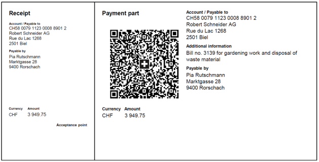

# Swiss QR Bill

[](https://travis-ci.org/sprain/php-swiss-qr-bill)
[](https://scrutinizer-ci.com/g/sprain/php-swiss-qr-bill/?branch=master)

A PHP library to create Swiss QR Bill payment parts, a new standard which will replace the existing inpayment slips starting on June 30, 2020.

Please note that the current state of the library only creates the qr code, but not yet full payment parts. This will be a next step of development.

[You are welcome to contribute.](https://github.com/sprain/php-swiss-qr-bill/issues)




## Official docs

For official information see
* https://www.paymentstandards.ch/en/home/roadmap/payment-slips.html
* https://www.six-group.com/interbank-clearing/en/home/standardization/payment-slips.html


## Installation

```
composer require sprain/swiss-qr-bill
```


## Usage
See [doc/example.php](doc/example.php).
